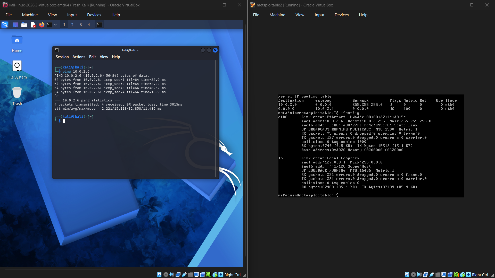

# Lab 01 — Kali → Metasploitable 2 Connectivity

## Objective

Verify that Kali Linux can communicate with Metasploitable 2 over the controlled `TestNetwork` before beginning security reconnaissance.

## Environment

| System | IP Address | Role |
|---|---|---|
| Kali Linux | `10.0.2.4` | Security workstation |
| Metasploitable 2 | `10.0.2.6` | Vulnerable training target |

Network:

```text
TestNetwork
10.0.2.0/24

Kali Linux
10.0.2.4
    │
    │ ICMP
    ▼
Metasploitable 2
10.0.2.6
```

## Procedure

From Kali Linux, the following command was executed:

```bash
ping 10.0.2.6
```

## Result

**Successful — 0% packet loss**

The captured output shows four ICMP echo requests sent to `10.0.2.6` and four replies received.

```text
4 packets transmitted, 4 received, 0% packet loss
```

The observed round-trip times were approximately:

```text
min: 2.221 ms
avg: 15.118 ms
max: 32.858 ms
```

## Evidence



The screenshot shows:

- Kali Linux on the left
- Metasploitable 2 on the right
- Kali executing `ping 10.0.2.6`
- Four successful ICMP replies
- Metasploitable 2 interface `eth0` configured with `10.0.2.6`

## Findings

1. Kali can reach Metasploitable 2 over the lab network.
2. ICMP traffic is successfully passing between the two virtual machines.
3. Both systems are communicating through the `TestNetwork` environment.
4. The lab is ready for the next controlled exercise: network reconnaissance and service enumeration.

## Lessons Learned

This test confirmed that the basic network path between the security workstation and the intentionally vulnerable target is working before starting security testing.

Performing connectivity verification first helps distinguish network/configuration problems from issues encountered during later reconnaissance or enumeration.

## Status

**Lab Status:** ✅ Completed

**Next Lab:** Metasploitable 2 network reconnaissance and service enumeration
